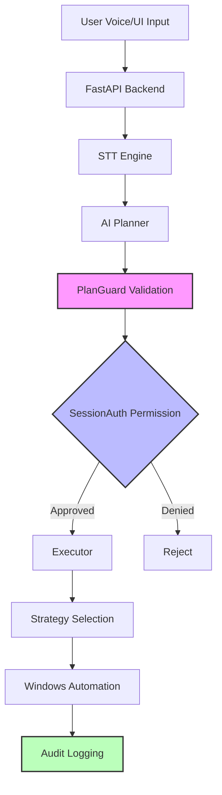
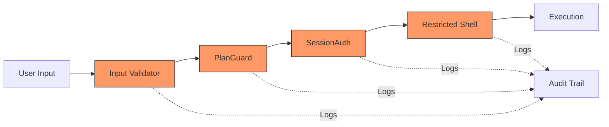

# Architecture Documentation

## System Architecture



## Security Layers



## Component Breakdown

### 1. Voice Pipeline

- **STT Engine**: Whisper-based speech-to-text
- **Fallback**: Mock engine for testing
- **WebSocket**: Real-time audio streaming

### 2. Planning Layer

- **AI Planner**: OpenAI-based command interpretation
- **Plan Guard**: Pre-execution validation
  - App allowlist checking
  - Domain allowlist checking
  - Risk scoring

### 3. Security Stack

- **SessionAuth**: Permission management
  - Time-based expiry
  - Explicit app/folder grants
  - Network permission control
- **Input Validator**: Whitelist-based validation
- **Secrets Filter**: Log redaction

### 4. Execution Engine

- **Executor**: Async task coordinator
- **Strategies**: Platform-specific implementations
  - SystemStrategy: Windows automation
  - AppStrategy: Application control
  - RestrictedShellTool: Sandboxed commands

### 5. Audit & Logging

- **Security Audit**: Structured logging
- **Rotating Logs**: Disk-safe storage
- **Secrets Redaction**: Privacy protection

## Data Flow

```
Voice Input → STT → AI Plan → Guard → Auth → Execute → Audit
     ↓         ↓       ↓       ↓      ↓        ↓         ↓
  WebSocket  Whisper  GPT   Validate Check  Windows  JSON Log
```

## Trust Boundaries

| Boundary             | Input      | Validation      | Output         |
| -------------------- | ---------- | --------------- | -------------- |
| **User → System**    | Voice/UI   | Input Validator | Sanitized      |
| **AI → Execution**   | Plan       | PlanGuard       | Approved Plan  |
| **Session → Action** | Permission | SessionAuth     | Granted        |
| **System → OS**      | Commands   | RestrictedShell | Safe Execution |

## Security Model

**Default-Deny**: Everything blocked unless explicitly allowed
**Fail-Closed**: Errors deny access, never grant
**Defense-in-Depth**: Multiple validation layers
**Least Privilege**: Minimum required permissions
**Audit Everything**: Comprehensive logging
