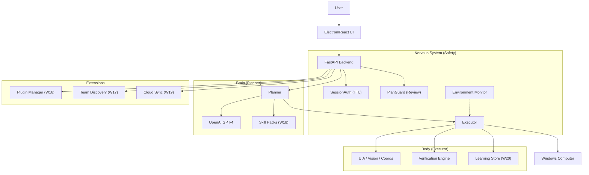

# ⚡ Flash Assistant

> **The Production-Grade, Collaborative, Learning Desktop Agent** (v1.0 Gold Standard)

[](https://www.python.org/)
[](https://reactjs.org/)
[](./README.md)
[](./LICENSE)

**Flash Assistant** (formerly CoworkAI) is a robust, agentic platform that automates complex desktop workflows. It evolves beyond simple automation by supporting **Multi-Agent Teams**, **Cloud Sync**, **Skill Packs**, and **Privacy-First Learning**.

---

## 🚀 Quick Start

Get running in 2 minutes.

### 1. Backend

```bash
# Install dependencies
pip install -r requirements.txt

# Start the Backend (Port 8765)
# Note: Requires OpenAI API Key in settings or env vars
python -m uvicorn assistant.main:app --reload --port 8765
```

### 2. UI (Electron/React)

```bash
cd ui
npm install
npm start
```

---

## 📂 Architecture Overview

Flash Assistant uses a **biology-inspired architecture**: Brain (Planner), Body (Executor), and Nervous System (Safety).



---

## ✨ Key Features (W1-W20)

| Phase     | Feature            | Description                                                  | Architecture             |
| :-------- | :----------------- | :----------------------------------------------------------- | :----------------------- |
| **W1-11** | **Execution Core** | Hybrid Strategies (UIA/Vision) + Self-Healing.               | `ReliableExecutor`       |
| **W16**   | **Marketplace** 🛒 | Signed Plugins (`.cowork-plugin`) with Ed25519 verification. | `PluginSigner`           |
| **W17**   | **Team Mode** 👥   | Peer Discovery (UDP) and Task Delegation API.                | `PeerDiscovery`          |
| **W18**   | **Skill Packs** 🧠 | Downloadable prompt/knowledge bundles.                       | `SkillLoader`            |
| **W19**   | **Cloud Sync** ☁️  | E2E Encrypted snapshot sync across devices.                  | `SyncEngine` + `AES-GCM` |
| **W20**   | **Learning** 🎓    | Privacy-preserving optimization (Stats collection).          | `LearningCollector`      |

---

## 🔒 Security Model

Flash Assistant is built for **Enterprise Safety**:

- **Session Auth:** Commands require a "Session Token" granted via Voice/UI with a strict TTL (30 mins).
- **PlanGuard:** Destructive actions (delete, send email) require explicit user confirmation.
- **Environment Monitor:** Background thread that detects "Lock Screen" or "UAC" and auto-pauses execution.
- **Redaction:** The Learning Collector (W20) automatically ignores sensitive windows (Bank, Login, Password) to prevent data leaks.
- **Sandboxed Plugins:** Plugins run in a separate process (`plugin_host`) with restricted permissions (W13).

---

## 🧪 Verification

Validate the system using the built-in test suite:

```bash
# Verify Marketplace (W16)
python test_phases/demo_w16_marketplace.py

# Verify Team Delegation (W17)
python test_phases/demo_w17_team_delegation.py

# Verify Cloud Sync (W19)
python test_phases/demo_w19_engine.py

# Verify Learning (W20)
python test_phases/demo_w20_learning.py
```

---

## 📦 Building for Production

1.  **Build Backend:** `python backend/build_backend.py`
2.  **Package UI:** `cd ui && npm run dist`

---

## 📄 License

MIT © 2026 Flash Assistant Project
