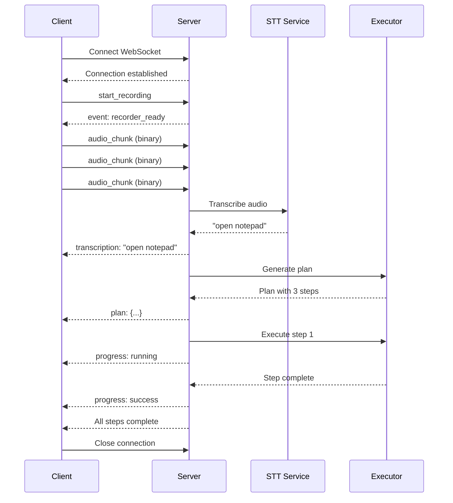

# WebSocket Message Contracts

**Version**: 1.0.0  
**Last Updated**: 2026-01-31

---

## Overview

Cowork AI Assistant uses WebSocket for real-time voice command processing. This document defines message contracts for bidirectional communication.

## Connection

### Endpoint

```
ws://localhost:8765/ws/voice
```

### Authentication

WebSocket connections require an active session. Ensure `/api/permission/grant` is called before connecting.

---

## Message Types

### Client → Server

#### 1. Voice Audio Stream

**Type**: Binary (Audio data)

```json
{
  "type": "audio_chunk",
  "format": "webm",
  "sample_rate": 16000,
  "channels": 1,
  "data": "<base64_encoded_audio>"
}
```

#### 2. Command

**Type**: Text (JSON)

```json
{
  "type": "command",
  "action": "start_recording" | "stop_recording" | "cancel",
  "request_id": "uuid-v4"
}
```

---

### Server → Client

#### 1. Transcription Result

```json
{
  "type": "transcription",
  "text": "open notepad",
  "confidence": 0.95,
  "language": "en-US",
  "timestamp": 1706745600
}
```

#### 2. Execution Plan

```json
{
  "type": "plan",
  "plan_id": "uuid-v4",
  "task": "open notepad",
  "steps": [
    {
      "id": "1",
      "tool": "open_app",
      "args": { "app_name": "notepad" },
      "description": "Open Notepad application"
    }
  ],
  "estimated_duration_sec": 2
}
```

#### 3. Execution Progress

```json
{
  "type": "progress",
  "step_id": "1",
  "status": "running" | "success" | "failed",
  "message": "Opening Notepad...",
  "screenshot": "<base64_screenshot>",
  "timestamp": 1706745602
}
```

#### 4. Error

```json
{
  "type": "error",
  "code": "TRANSCRIPTION_FAILED" | "NO_PERMISSION" | "EXECUTION_ERROR",
  "message": "User-friendly error description",
  "recoverable": true,
  "retry_after_sec": 5
}
```

#### 5. System Event

```json
{
  "type": "event",
  "event": "session_expired" | "connection_timeout" | "recorder_ready",
  "data": {}
}
```

---

## Connection Lifecycle

### 1. Connect

```javascript
const ws = new WebSocket("ws://localhost:8765/ws/voice");

ws.onopen = () => {
  console.log("Connected to voice assistant");
};
```

### 2. Start Recording

```javascript
ws.send(
  JSON.stringify({
    type: "command",
    action: "start_recording",
    request_id: crypto.randomUUID(),
  }),
);
```

### 3. Stream Audio

```javascript
// Send audio chunks (binary)
navigator.mediaDevices.getUserMedia({ audio: true }).then((stream) => {
  const mediaRecorder = new MediaRecorder(stream);
  mediaRecorder.ondataavailable = (event) => {
    if (event.data.size > 0) {
      ws.send(event.data); // Binary audio
    }
  };
});
```

### 4. Receive Results

```javascript
ws.onmessage = (event) => {
  const message = JSON.parse(event.data);

  switch (message.type) {
    case "transcription":
      console.log("Heard:", message.text);
      break;
    case "plan":
      console.log("Plan:", message.steps.length, "steps");
      break;
    case "progress":
      updateUI(message);
      break;
    case "error":
      handleError(message);
      break;
  }
};
```

### 5. Disconnect

```javascript
ws.close();
```

---

## Error Codes

| Code                   | Description                | Recoverable              |
| ---------------------- | -------------------------- | ------------------------ |
| `TRANSCRIPTION_FAILED` | STT service error          | Yes (retry)              |
| `NO_PERMISSION`        | Session expired            | Yes (re-grant)           |
| `EXECUTION_ERROR`      | Plan execution failed      | Maybe (depends on error) |
| `INVALID_AUDIO`        | Audio format unsupported   | No (client issue)        |
| `TIMEOUT`              | Operation exceeded timeout | Yes (retry)              |
| `RATE_LIMIT`           | Too many requests          | Yes (backoff)            |

---

## Best Practices

### Client-Side

1. **Reconnection**: Implement exponential backoff on disconnect
2. **Buffering**: Buffer audio before sending to reduce overhead
3. **Heartbeat**: Send ping every 10s to keep connection alive
4. **Error Handling**: Always handle `error` and `event` messages

### Server-Side

1. **Timeout**: Close idle connections after 30s
2. **Rate Limiting**: Limit audio chunks to 10/sec per client
3. **Session Validation**: Verify session on every message
4. **Graceful Degradation**: Fall back to polling if WebSocket fails

---

## Example Flow



---

## Testing

### Manual Test

```bash
# Install wscat
npm install -g wscat

# Connect
wscat -c ws://localhost:8765/ws/voice

# Send command
{"type":"command","action":"start_recording","request_id":"test-123"}
```

### Automated Test

See `tests/integration/test_websocket.py` for WebSocket integration tests.

---

**For implementation details, see**:

- `assistant/api/voice_routes.py` - WebSocket endpoint
- `assistant/voice/stt.py` - Speech-to-text integration
- `ui/src/services/voiceService.js` - Client implementation
